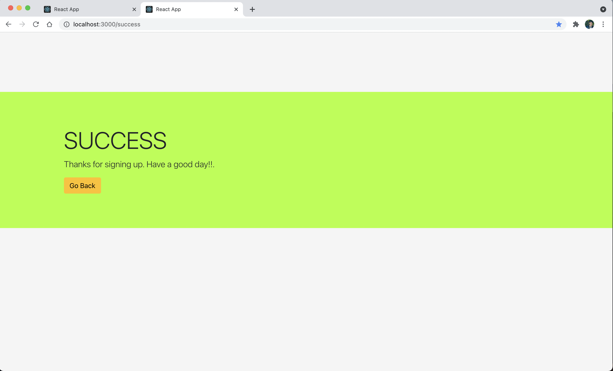

# Newsletter Form Application with Appwrite and React


[Appwrite](https://github.com/appwrite/appwrite) is an open-source application that is built on the concept of a self-hosted backend as a service server that provides user-friendly ways to build an application.
It abstracts the time-consuming development tasks and provides pre-built SDKs to integrate your application with Appwrite APIs. 
It supports multiple languages and its UI is super cool to work with.


This repo contains the code for the Newsletter Application. I wrote a blog on it at [Medium](https://thebeginner86.medium.com/newsletter-form-application-with-appwrite-and-react-2791bd38a457). Do check it out first as we would be using the concepts explained in that article. It would be helpful, if your are looking forward to using [Appwrite](https://github.com/appwrite/appwrite) in your next React application. I've explained about integrating [Appwrite](https://github.com/appwrite/appwrite) with [React](https://github.com/facebook/react) through its web client SDKs.
<br />
<br />

### Screenshots:

<br />





<hr>
<br />

## Setup Instructions

<br />

1. First you need to start Appwrite services (make sure you have [Docker](https://docs.docker.com/get-docker/) installed on your system)

- **Unix**

```
docker run -it --rm \
    --volume /var/run/docker.sock:/var/run/docker.sock \
    --volume "$(pwd)"/appwrite:/usr/src/code/appwrite:rw \
    --entrypoint="install" \
    appwrite/appwrite:0.10.4
```

- **Windows**

<br />

CMD
```
docker run -it --rm ^
    --volume //var/run/docker.sock:/var/run/docker.sock ^
    --volume "%cd%"/appwrite:/usr/src/code/appwrite:rw ^
    --entrypoint="install" ^
    appwrite/appwrite:0.10.4
```
<br/>

PowerShell
```
docker run -it --rm ,
    --volume /var/run/docker.sock:/var/run/docker.sock ,
    --volume ${pwd}/appwrite:/usr/src/code/appwrite:rw ,
    --entrypoint="install" ,
    appwrite/appwrite:0.10.4
```
<br />

Once the Docker installation completes, go to http://localhost to access the Appwrite console from your browser.


2. Fork this repository. This will create a local copy of this Repository on your Github profile.

3. Clone it
```
$ git clone https://github.com/<your-username>/appwrite-react  
$ cd appwrite-react
```  

4. Install the dependencies
```
$ npm i
```

5. Inorder for the application to work, you need to take few ids from your project on Appwrite. Its detailed steps have been explained on my [Medium](https://thebeginner86.medium.com/newsletter-form-application-with-appwrite-and-react-2791bd38a457) article. Besure to check that out before you run your application.

6. You need to create a .env file so that those ids and credentials could be appended in it and the React applciation could easily pick those from .env file.

```
$ touch .env
```

7. Take reference from .env.example file

You would require following values: <br /><br />
```
REACT_APP_ENDPOINT=
REACT_APP_PROJECT_ID=
REACT_APP_COLLECTION_ID=
REACT_APP_USER_CREDENTIALS_EMAIL=
REACT_APP_USER_CREDENTIALS_PASSWORD=
```

You need to copy these into .env and take values from your Appwrite project which we had setup on my [Medium](https://thebeginner86.medium.com/newsletter-form-application-with-appwrite-and-react-2791bd38a457) article.

> Dont get intimidated. These are very easy to extract. Just follow my [Medium](https://thebeginner86.medium.com/newsletter-form-application-with-appwrite-and-react-2791bd38a457) article and everything would fall in place.

5. Now start the server
```
$ npm start
```

6. To check the running application, go to http://localhost:3000 

<hr>

## Demo


<hr>


Thanks for testing out my application.
If you have any doubts then feel free to ask me on [Twitter](https://twitter.com/theBeginner86). My DMs are always open to interact with people 🙌

Inorder to understand the basics do checkout my article on [Medium](https://thebeginner86.medium.com/newsletter-form-application-with-appwrite-and-react-2791bd38a457).

### Developed with ❤️ by  [Pranav Singh](https://twitter.com/theBeginner86) 😎 👨‍💻
